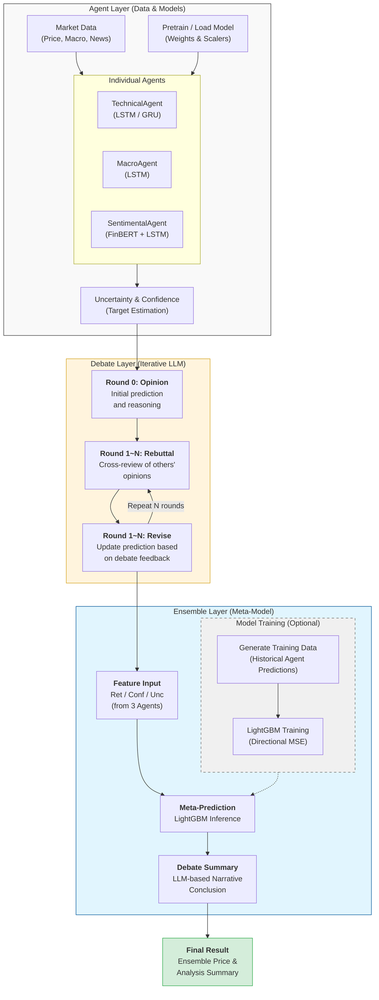

제공된 최신 소스 코드와 시스템 구조, 그리고 요청하신 v2.0의 핵심 내용을 결합하여 고도화된 `README.md` 파일을 작성해 드립니다.

---

# 🧠 AI Stock Debate System (v2.0)

> **다중 전문 에이전트 간의 신뢰도 기반 토론 및 앙상블 학습 주식 예측 시스템**

## 📋 프로젝트 개요

본 프로젝트는 서로 다른 전문 분야(기술적 분석, 거시경제, 시장 심리)를 가진 AI 에이전트들이 특정 주식 종목에 대해 토론하고, 각자의 예측 불확실성을 바탕으로 의견을 수정하여 최종 합의안을 도출하는 **Advanced MVP** 시스템입니다. 특히 최종 단계에서 각 에이전트의 예측치와 신뢰도를 피처로 활용하는 **LightGBM 기반 메타 앙상블 모델**을 통해 예측 정확도를 극대화합니다.

### 🎯 핵심 차별점

* **다중 전문 에이전트**: Technical(차트), Sentimental(뉴스/심리), Macro(거시경제) 에이전트의 협력 분석 수행
* **신뢰도 기반 Revise**: Monte Carlo Dropout으로 측정된 불확실성()을 기반으로 토론 과정에서 자신의 의견을 수정
* **지능형 메타 앙상블**: 에이전트별 예측치, 신뢰도, 불확실성을 피처로 입력받아 학습된 **LightGBM** 모델이 최종가 산출
* **설명 가능한 AI (XAI)**: Grad×Input, SHAP, Integrated Gradients 등을 활용하여 예측 근거를 분석하고 LLM이 투자 리포트 생성
* **실시간 인터랙티브 대시보드**: Streamlit을 활용하여 실시간 주가 데이터와 에이전트 간 토론 로그 시각화

---

## 🏗️ 시스템 아키텍처 및 데이터 흐름



---

## 🚀 빠른 시작

### 1. 환경 설정

Python 3.10 이상의 환경에서 다음을 실행합니다.

```bash
# 의존성 설치
pip install -r requirements.txt

```

### 2. 환경 변수 설정

프로젝트 루트 폴더에 `.env` 파일을 생성하고 다음 API 키를 입력합니다.

```bash
CAPSTONE_OPENAI_API=your_openai_key  # 토론 요약 및 근거 생성용
EODHD_API_KEY=your_eodhd_key        # SentimentalAgent 뉴스 수집용

```

### 3. 실행 방법

#### **방법 1: Streamlit 대시보드 (권장)**

```bash
streamlit run streamlit_dashboard.py

```

* 웹 인터페이스에서 실시간 주가 차트, 에이전트별 토론 과정, 최종 앙상블 리포트를 확인할 수 있습니다.

#### **방법 2: CLI 실행**

```bash
# 기본 실행 (티커: NVDA, 3라운드 토론)
python main.py --ticker NVDA --rounds 3

# 모델 강제 재학습 및 데이터셋 재생성 포함
python main.py --ticker AAPL --force-pretrain

```

---

## 🎭 에이전트 및 기술 상세

| 에이전트 | 분석 영역 | 모델 아키텍처 | 주요 피처 |
| --- | --- | --- | --- |
| **Technical** | 차트 패턴 | LSTM + Time-Attention | RSI, MACD, BB, OBV 등 (13종) |
| **Macro** | 거시경제 | Stacked LSTM (3-Layer) | 금리, 환율, 유가, VIX, 지수 등 (50종 이상) |
| **Sentimental** | 시장 심리 | Sentimental LSTM | FinBERT 감성 점수, 뉴스 빈도, 거래량 변동 |

---

## 🔄 핵심 알고리즘 및 프로세스 (DebateSystem)

### 1. 토론 및 합의 프로세스

* **Round 0 (Opinion)**: 각 에이전트가 독립적으로 데이터를 분석하여 초기 예측 및 근거 생성
* **Round 1~N (Rebuttal)**: 타 에이전트의 예측 논리를 검토하여 '반박(REBUT)' 또는 '지지(SUPPORT)' 수행
* **Round 1~N (Revise)**: 토론 내용을 바탕으로 모델을 **Fine-tuning**하거나 불확실성 기반 가중치로 예측 수정

### 2. 신뢰도 기반 합의 공식

각 에이전트의 불확실성()의 역수를 가중치()로 사용하여 합의 가격을 계산합니다.


### 3. LightGBM 메타 앙상블

에이전트들의 예측 성과를 학습한 모델로 최종 결과를 도출합니다.

* **입력 피처**: 에이전트별 `Predicted Return`, `Confidence`, `Uncertainty`
* **목적 함수**: 방향성 오차에 추가 패널티를 주는 커스텀 MSE (`directional_mse_objective`) 적용

---

## 📊 검증 및 최적화 도구

### 📈 Rolling Backtest

과거 특정 시점부터 매 거래일마다 모델을 재학습하며 예측 성능(MSE, 방향 정확도 등)을 측정합니다.

```bash
python backtest.py --ticker TSLA --start 2024-01-01 --predict-days 10

```

### ⚙️ Hyperparameter Tuning

그리드 서치 방식으로 에이전트별 최적의 `window_size`, `learning_rate` 등을 자동 탐색합니다.

```bash
python run_tuning.py

```

---

## 📁 프로젝트 구조

```plaintext
capstone/
├── agents/             # 에이전트 핵심 로직 및 DebateSystem 관리
├── core/               # 데이터셋 관리 및 모델 아키텍처 (LSTM, 기술지표 등)
├── config/             # 에이전트 설정(agents_set.py) 및 LLM 프롬프트
├── scripts/            # 학습 데이터 생성 및 메타 모델 학습 스크립트
├── models/             # 학습된 모델(*.pt) 및 스케일러(*.pkl) 저장소
├── main.py             # CLI 진입점
└── streamlit_dashboard.py # 시각화 및 웹 대시보드

```

---

**Disclaimer**: 본 시스템은 투자 참고용이며, 모든 투자 결정의 책임은 사용자에게 있습니다.